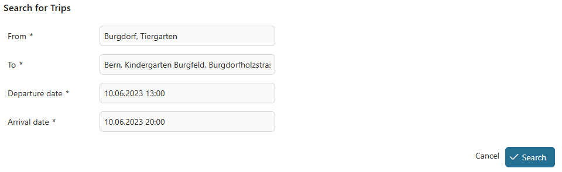
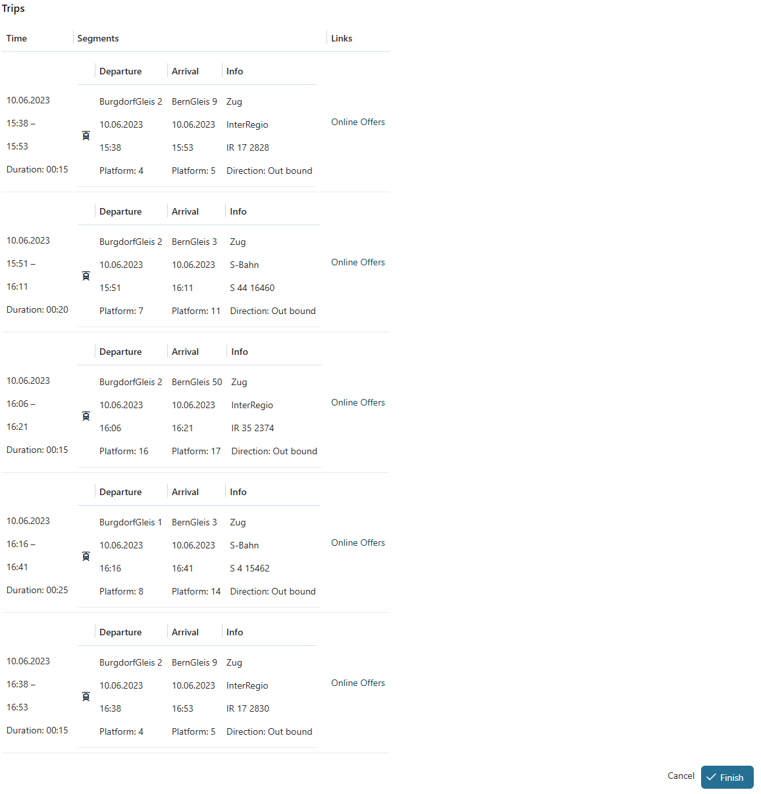

# SBB Connector

Axon Ivy's SBB Connector seamlessly integrates the [Swiss Mobility API](https://developer.sbb.ch/apis/b2p/information) and [Swiss Mobility API - Journey](https://developer-int.sbb.ch/apis/smapi-osdm-journey/information) provided by SBB (Swiss Federal Railways) into your business processes. This powerful connector enables organizations to embed comprehensive Swiss public transport capabilities directly into their workflows, providing access to real-time timetables, fare information, and booking management.

## Description

The SBB Connector bridges the gap between business process automation and Switzerland's public transportation network. Built on the robust Axon Ivy platform, this connector leverages RESTful APIs to deliver mission-critical transportation services to your applications.

**What it does:**
- Enables real-time search and retrieval of public transport schedules across Switzerland
- Provides detailed fare calculations and pricing information
- Facilitates programmatic booking creation and management for train, bus, and other public transport
- Integrates with OAuth2-secured SBB APIs using industry-standard authentication

**Problem it solves:**
Organizations need to integrate public transportation services into their business workflows—whether for employee travel management, customer journey planning, or integrated mobility solutions. The SBB Connector eliminates the complexity of direct API integration by providing ready-to-use callable processes that handle authentication, data transformation, and error handling.

**Value it brings:**
- **Accelerated Development**: Pre-built callable processes reduce integration time from weeks to days
- **Reliability**: Built on OSDM (Open Standard Distribution Model) Version 3, ensuring compatibility and future-proofing
- **Flexibility**: Easily embed transportation capabilities into existing Axon Ivy business processes
- **Cost Efficiency**: While SBB provides credentials free of charge, the API enables revenue generation through seamless ticket sales integration
- **User Experience**: Rich demo application showcases best practices for building transportation-enabled user interfaces

## Features

The SBB Connector provides comprehensive capabilities for integrating Swiss public transportation:

- **Place & Location Search**  
  Find transportation stops, stations, and points of interest using the `GetPlaces` callable process (implements OSDM standard).

- **Trip Search & Planning**  
  Query available connections between locations with `GetTripsCollection`, providing detailed journey information including transfers, durations, and route options.

- **Timetable Information**  
  Access real-time schedule data for trains, buses, trams, and other Swiss public transport modes.

- **Fare Calculation**  
  Retrieve comprehensive pricing information and fare details for planned journeys.

- **Booking Management**  
  Create, modify, and manage bookings programmatically through the API, enabling end-to-end ticket purchasing workflows.

- **OSDM V3 Compliance**  
  Built on the Open Standard Distribution Model Version 3, ensuring standardized data exchange and interoperability.

- **Dual API Support**  
  Integrates both the Swiss Mobility API (B2P) and Journey API, providing comprehensive coverage of SBB services.

- **OAuth2 Authentication**  
  Secure API access with Microsoft Azure AD-based OAuth2 client credentials flow, automatically managed by the connector.

- **Demo Application**  
  Interactive web interface demonstrating trip search functionality with a clean, user-friendly design.

- **Backward Compatibility**  
  Maintains support for legacy `GetLocations` and `GetTrips` processes while offering modern alternatives.

> [!Note]
> If you have not used this connector yet, you can ignore this note.
> From this version, `GetLocations` and `GetTrips` callable processes are deprecated.
> You can visit the info page of the [Swiss Mobility API](https://developer.sbb.ch/apis/b2p/information) to get more information.
> Instead, we have introduced two alternative `GetPlaces` and `GetTripsCollection` callable processes.
> However, the data classes are changed, you need to adapt your implementation to use these callable processes.

## Demo

The SBB Connector includes a comprehensive demo application showcasing the integration capabilities:

**Search for Trips**  
The intuitive search form allows users to select origin and destination, specify travel dates and times, and search for available connections.



**View Trip Results**  
The results display provides detailed journey information including departure/arrival times, duration, number of transfers, and allows users to select their preferred connection.



## Setup

### Prerequisites

Before using the SBB Connector, you need to obtain API credentials from SBB:

1. **Register for API Access**: Visit the [SBB Developer Portal](https://developer.sbb.ch/) to register and request access to the Swiss Mobility API. Follow their onboarding process to receive your credentials.
2. **Obtain Credentials**: You will receive:
   - Client ID (UUID format)
   - Client Secret
   - Contract ID
   - OAuth2 Token Endpoint
   - API Scope
   - API Base URLs (integration and/or production)

> [!Important]
> While credentials are provided free of charge by SBB, the API is designed for business-to-business sales transactions. For more information about access, features, and capabilities, visit the [Swiss Mobility API information page](https://developer.sbb.ch/apis/b2p/information).

### Installation

**Option 1: Axon Ivy Marketplace**  
Install the SBB Connector directly from the [Axon Ivy Marketplace](https://market.axonivy.com/).

**Option 2: Maven Dependency**  
Add the following dependency to your project's `pom.xml`:

```xml
<dependency>
  <groupId>com.axonivy.connector.sbb</groupId>
  <artifactId>sbb-connector</artifactId>
  <version>12.0.0</version>
  <type>iar</type>
</dependency>
```

Optionally, include the demo application:

```xml
<dependency>
  <groupId>com.axonivy.connector.sbb</groupId>
  <artifactId>sbb-connector-demo</artifactId>
  <version>12.0.0</version>
  <type>iar</type>
</dependency>
```

### Configuration

Add the following variables to your Axon Ivy project's `variables.yaml` file:

```
@variables.yaml@
```

**Configuration Parameters:**

- `uri`: The base URI of the B2P API
  - Integration: `https://b2p-int.api.sbb.ch`
  - Production: `https://b2p.api.sbb.ch`

- `contractId`: Your contract identifier provided by SBB (e.g., `ACP1024`)

- `clientId`: Your OAuth2 client ID in UUID format (e.g., `01234567-89ab-cdef-0123-456789abcdef`)

- `clientSecret`: Your encrypted client secret (use Axon Ivy's password encryption)

- `tokenEndpoint`: OAuth2 token endpoint URL  
  Example: `https://login.microsoftonline.com/2cda5d11-f0ac-46b3-967d-af1b2e1bd01a/oauth2/v2.0/token`

- `scope`: API access scope provided by SBB

- `journeyUri`: The base URI of the Journey API
  - Integration: `https://smapi-osdm-journey-int.api.sbb.ch`
  - Production: `https://smapi-osdm-journey.api.sbb.ch`

### Requestor Header Configuration

The SBB Swiss Mobility API requires a `Requestor` header for audit and tracking purposes. You can provide this in two ways:

1. **Custom Field (Recommended)**: Set the custom field `requestor` at the beginning of your process:
   ```java
   ivy.case.customFields().stringField("requestor").set("YourApplicationName/1.0");
   ```

2. **Process Argument**: Pass the `Requestor` as an argument when calling SBB Connector subprocesses.

Refer to the demo project for implementation examples.

### Verifying Installation

After configuration:

1. Deploy your project to an Axon Ivy Engine
2. Ensure the SBB Connector and your project are in the same security context
3. Run the demo application to verify the connection
4. Test the `GetPlaces` and `GetTripsCollection` callable processes

For troubleshooting and additional information, consult the [SBB Developer Portal](https://developer.sbb.ch/).