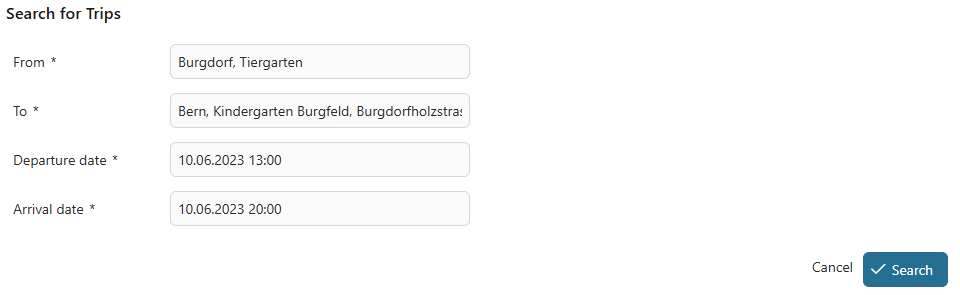
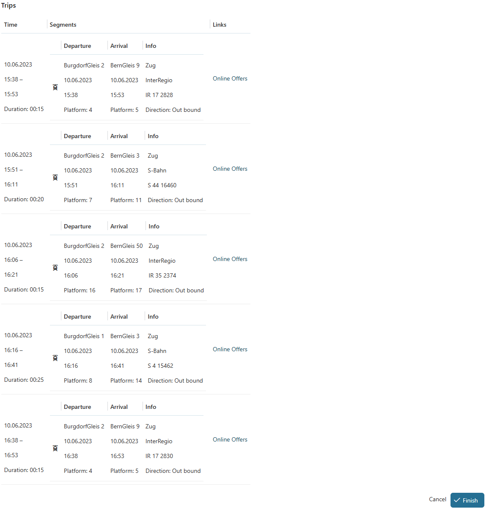

# SBB Konnektor

Axon Ivy's SBB Konnektor integriert die [Swiss Mobility API - Journey](https://developer-int.sbb.ch/apis/smapi-osdm-journey/information) der SBB (= Schweizerische Bundesbahnen). Dieser Konnektor nutzt einen REST-Client, der es dir ermöglicht, Fahrpläne und Tarifdetails abzurufen. Zusätzlich kannst du über die API Buchungen für den  öffentlichen Verkehr der Schweiz erstellen und verwalten.

Beachte, dass Zugangsdaten erforderlich sind, um auf die Funktionen der API zuzugreifen. Obwohl diese von der SBB kostenlos zur Verfügung gestellt werden, dient ihre API dazu, Umsätze zu generieren. Weitere Informationen zu Zugang, Funktionen und Möglichkeiten findest du auf der Infoseite der Swiss Mobility API- Journey.

## Demo





## Setup

To use the SBB Connector, add the following variables to your Axon Ivy Project:

```
@variables.yaml@
```

Any request to the Journey SBB Swiss Mobility API requires a `Requestor` header of the current business process. For the already provided subprocesses by the SBB Connector you can either set the customField `requestor` at the beginning of a process or provide the `Requestor` as an argument each time you call a subprocess. Take a look at the demo project for an example.

> [!Note]
> If you have not used this connector yet, you can ignore this note.
> From this version, `GetLocations` and `GetTrips` callable processes are deprecated.
> You can visit the info page of the [Swiss Mobility API](https://developer.sbb.ch/apis/b2p/information) to get more information.
> Instead, We have introduced two alternative `GetPlaces` and `GetTripsCollection` callable processes.
> However, the data class are changed, you need to adapt it to use these callable processes.